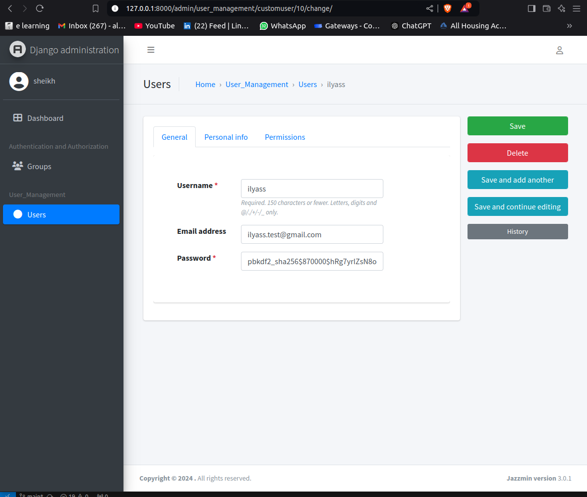
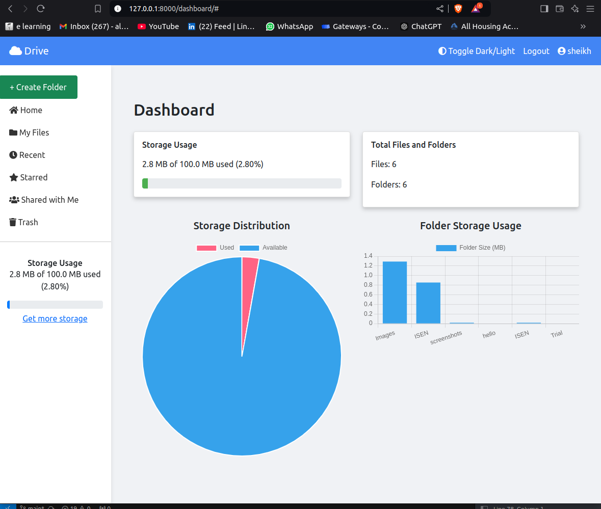

# Google Drive Clone

### Google drive application clone made with Django

### DEMO: [Google Drive Clone]()

<table width="100%"> 
<tr>
<td width="50%">      
&nbsp; 
<br>
<p align="center">
  ADMIN
</p>
<kbd></kbd>
</td> 
<td width="50%">
<br>
<p align="center">
  CLIENT
</p>
  
</td>
</table>

## Tech Stack
- **Backend:** Django
- **Frontend:** HTML, CSS, Bootstrap
- **Database:** SQLite (default), can be configured to use PostgreSQL or MySQL
- **Authentication:** Custom User Model
- **Libraries:** Font Awesome for icons, jQuery for interactivity
- **Django-Jazzmin:** template for django admin `https://django-jazzmin.readthedocs.io/`

## Project Structure
```
user@user:~/Documents/JUNIA 2024/python course/Django_Projects/google_drive_clone$ tree -I 'env'
.
├── db.sqlite3
├── file_management
│   ├── admin.py
│   ├── apps.py
│   ├── __init__.py
│   ├── migrations
│   │   ├── __init__.py
│   │   └── __pycache__
│   │       └── __init__.cpython-310.pyc
│   ├── models.py
│   ├── __pycache__
│   │   ├── admin.cpython-310.pyc
│   │   ├── apps.cpython-310.pyc
│   │   ├── __init__.cpython-310.pyc
│   │   └── models.cpython-310.pyc
│   ├── tests.py
│   └── views.py
├── folder_management
│   ├── admin.py
│   ├── apps.py
│   ├── __init__.py
│   ├── migrations
│   │   ├── 0001_initial.py
│   │   ├── 0002_alter_folder_name_alter_folder_unique_together.py
│   │   ├── 0003_alter_folder_unique_together_alter_folder_name.py
│   │   ├── __init__.py
│   │   └── __pycache__
│   │       ├── 0001_initial.cpython-310.pyc
│   │       ├── 0002_alter_folder_name_alter_folder_unique_together.cpython-310.pyc
│   │       ├── 0003_alter_folder_unique_together_alter_folder_name.cpython-310.pyc
│   │       └── __init__.cpython-310.pyc
│   ├── models.py
│   ├── __pycache__
│   │   ├── admin.cpython-310.pyc
│   │   ├── apps.cpython-310.pyc
│   │   ├── __init__.cpython-310.pyc
│   │   ├── models.cpython-310.pyc
│   │   ├── urls.cpython-310.pyc
│   │   └── views.cpython-310.pyc
│   ├── templates
│   │   └── folder_management
│   │       ├── copy_folder_modal.html
│   │       ├── create_folder_modal.html
│   │       ├── create_subfolder_modal.html
│   │       ├── delete_folder_modal.html
│   │       ├── edit_folder_modal.html
│   │       ├── list_folders.html
│   │       └── move_folder_modal.html
│   ├── templatetags
│   │   ├── folder_tags.py
│   │   ├── __init__.py
│   │   └── __pycache__
│   │       ├── folder_tags.cpython-310.pyc
│   │       └── __init__.cpython-310.pyc
│   ├── tests.py
│   ├── urls.py
│   └── views.py
├── google_drive_clone
│   ├── asgi.py
│   ├── __init__.py
│   ├── __pycache__
│   │   ├── __init__.cpython-310.pyc
│   │   ├── settings.cpython-310.pyc
│   │   ├── urls.cpython-310.pyc
│   │   └── wsgi.cpython-310.pyc
│   ├── settings.py
│   ├── urls.py
│   └── wsgi.py
├── images
│   ├── admin.png
│   └── drive.png
├── manage.py
├── README.md
└── user_management
    ├── admin.py
    ├── apps.py
    ├── forms.py
    ├── __init__.py
    ├── migrations
    │   ├── 0001_initial.py
    │   ├── __init__.py
    │   └── __pycache__
    │       ├── 0001_initial.cpython-310.pyc
    │       └── __init__.cpython-310.pyc
    ├── models.py
    ├── __pycache__
    │   ├── admin.cpython-310.pyc
    │   ├── apps.cpython-310.pyc
    │   ├── forms.cpython-310.pyc
    │   ├── __init__.cpython-310.pyc
    │   ├── models.cpython-310.pyc
    │   ├── urls.cpython-310.pyc
    │   └── views.cpython-310.pyc
    ├── templates
    │   ├── home.html
    │   └── user_management
    │       ├── login.html
    │       ├── password_reset_complete.html
    │       ├── password_reset_confirm.html
    │       ├── password_reset_done.html
    │       ├── password_reset_form.html
    │       ├── profile.html
    │       └── signup.html
    ├── tests.py
    ├── urls.py
    └── views.py

21 directories, 85 files
sheikh@sheikh:~/Documents/JUNIA 2024/python course/Django_Projects/google_drive_clone$ 
    
```

## Run these Commands

These instructions will get you a copy of the project up and running on your local machine for development and testing purposes.

### Step 1: Clone the repository
```bash
git clone https://github.com/dev-sheikh-ali/google_drive_clone.git
```

### Step 2: Navigate to the cloned directory
```bash
cd google_drive_clone
```

### Step 3: Create a virtual environment
```bash
python3 -m venv env
```

### Step 4: Activate the virtual environment
- On macOS/Linux:
```bash
source env/bin/activate
```
- On Windows:
```bash
env\Scripts\activate
```

### Step 5: Install Python dependencies
```bash
pip install -r requirements.txt
```

### Step 6: Run database migrations
```bash
python manage.py migrate
```

### Step 7: Create a superuser (optional)
```bash
python manage.py createsuperuser
```

### Step 8: Run the server
```bash
python manage.py runserver
```

### Step 9: Access the application
Open your browser and go to `http://127.0.0.1:8000/signup` to create a new account or `http://127.0.0.1:8000/login` to log in.

## Features
- User registration and authentication
- File and folder management
- Dark and light mode toggle
- Profile management

## License
This project is licensed under the MIT License - see the [LICENSE](LICENSE) file for details.
